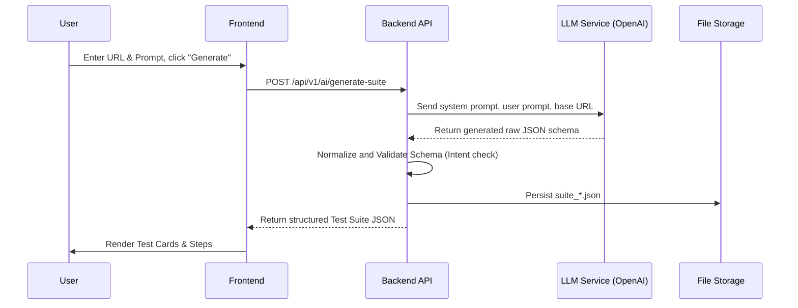
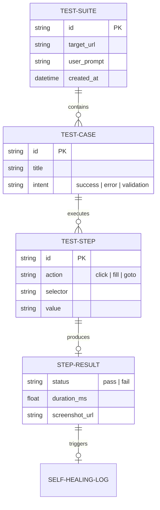

# Nova Test Suite Generator - Architecture Design

This document outlines the detailed architecture of the Nova Test Suite Generator platform, including the interaction between the frontend, API gateways, execution engines, and the self-healing components.

## 1. High-Level System Architecture

The platform utilizes a modular, microservice-inspired design. The architecture segregates responsibilities into distinct areas: User Interface (Frontend), Orchestration (Backend/API), Execution Engine, and Data Persistence.

```mermaid
graph TD
    %% Frontend Components
    subgraph Client [Frontend UI (React + Vite)]
        A1[Dashboard / Input]
        A2[Test Suite Viewer]
        A3[Execution Monitor]
        A4[Artifact Explorer]
    end

    %% Backend Services
    subgraph Backend [Backend API (FastAPI / Node.js)]
        B1[API Router / Middleware]
        B2[LLM Generator Service]
        B3[Job / Execution Queue]
        B4[Artifact Manager]
    end

    %% Execution Engine
    subgraph Execution [Execution Engine (Playwright)]
        C1[Browser Orchestrator]
        C2[Action Handlers]
        C3[Self-Healing Module]
        C4[Screenshot & Log Capture]
    end

    %% Storage & External
    subgraph External [External & Storage]
        D1[(Local Storage / DB)]
        D2[OpenAI / LLM API]
        D3[Target Web App]
    end

    %% Flow connections
    A1 -->|POST /generate-suite| B1
    A3 -->|POST /generate-and-run| B1
    A4 -->|GET /suites, /reports| B1

    B1 --> B2
    B1 --> B3
    B1 --> B4

    B2 <-->|Prompt & Schema Validation| D2
    B3 -->|Dispatch Test Job| C1
    
    C1 --> C2
    C2 <-->|Interact / Validate| D3
    C2 <-->|Fallback on Error| C3
    C3 <-->|LLM Semantic Matching| D2
    
    C4 -->|Save Artifacts| B4
    B4 -->|Read/Write JSON & HTML| D1
```

---

## 2. Component Deep Dive

### 2.1 AI-Driven Test Generation Workflow
When a user requests a new test suite, the system dynamically generates tests based on the target URL and user prompts.



### 2.2 Execution & Self-Healing Pipeline
The execution engine is built around Playwright. It includes a robust self-healing mechanism that engages when standard element selectors fail or drift due to DOM changes.

```mermaid
flowchart TD
    Start([Start Test Run]) --> InitBrowser[Init Playwright Browser Context]
    InitBrowser --> StepLoop[Process Next Step]
    
    StepLoop --> ExecAction{Execute Action\n(e.g., click, fill)}
    
    ExecAction -->|Success| Capture[Capture Screenshots/Logs]
    Capture --> CheckDone{More steps?}
    CheckDone -->|Yes| StepLoop
    CheckDone -->|No| Finish([Finish Test Run - Pass])
    
    ExecAction -->|Timeout / Not Found| Healing(Invoke Self-Healing)
    Healing --> Strategy1{Try DOM History/}
    Strategy1 -->|Match Found| HealSuccess(Update Selector & Retry)
    Strategy1 -->|No Match| Strategy2{LLM Semantic Analysis}
    
    Strategy2 -->|Match Found| HealSuccess
    HealSuccess --> ExecAction
    
    Strategy2 -->|No Match| FailStep(Fail Step)
    FailStep --> RunLevelCapture[Capture Failure Screenshot]
    RunLevelCapture --> FinishFail([Finish Test Run - Fail])
```

---

## 3. Storage and Persistence Model

The platform uses a file-based storage abstraction (with potential evolution to relational DB like PostgreSQL/Prisma).

- **`/storage/suites/`**: Stores AI-generated structured `.json` payloads.
- **`/storage/screenshots/`**: Ephemeral and persistent image storage for visual validation. Includes both intermediate step captures and run-level failure states.
- **`/storage/reports/`**: Synthesized `.html` test reports for human-readable outputs.

### 3.1 Data Schema (Entity Relationship)



## 4. Scalability and Future Roadmap

- **Message Queues**: Decoupling the frontend trigger from the backend execution using Redis or RabbitMQ to support concurrent multi-suite execution.
- **Persistent Database**: Moving from file-based storage to a PostgreSQL schema via Prisma ORM (currently under development in `backend-node/`).
- **WebSockets / Server-Sent Events (SSE)**: For real-time, step-by-step streaming of execution logs directly to the frontend.
